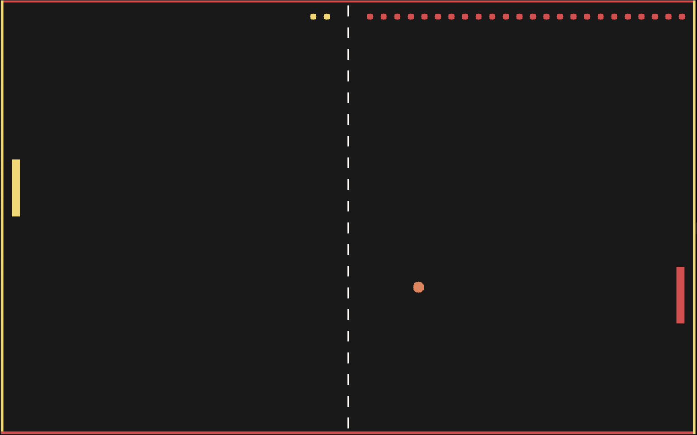
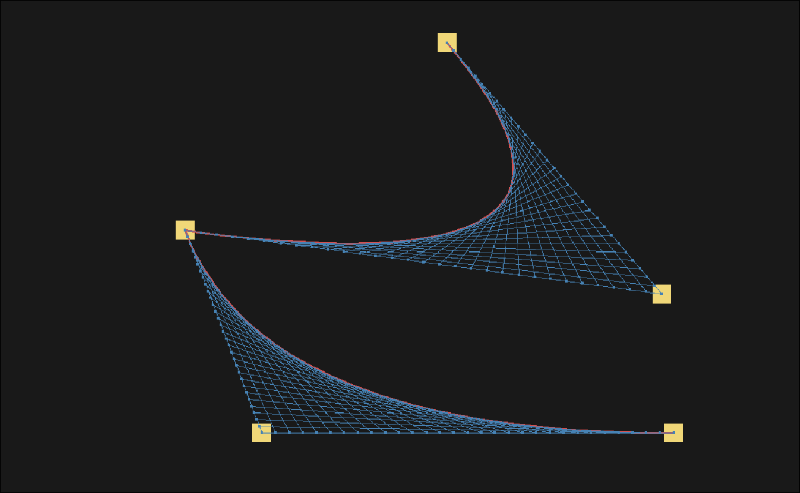

# kross

This project is my painful 1-year journey through C and computer graphics. 

Kross is a software rasterizer with a tiny math "library", color manipulation, interpolation, procedural noise, and whatever else I ended up needing along the way.

# Why this exists
It is meant to be read, so I dont wanna hear any complaints when this thing runs at 60 seconds per frame instead of 60 frames per second.        
It is very, very heavily commented, with comments and explanations that I wish I had starting out.

This project is dedicated to God and Orthodox Christianity, as a small thank you for everything I have been given in life.

# Compatibility
Kross is developed and tested for Arch Linux (btw). It uses OpenGL 1.1 as a presenter so it should work fine for Windows too. If you run into any issues, let me know.

## Contribution Policy
I wont be accepting contributions because this is a personal project, and I want it to stay that way.
# Examples
## Snake

## Pong

## Bezier

