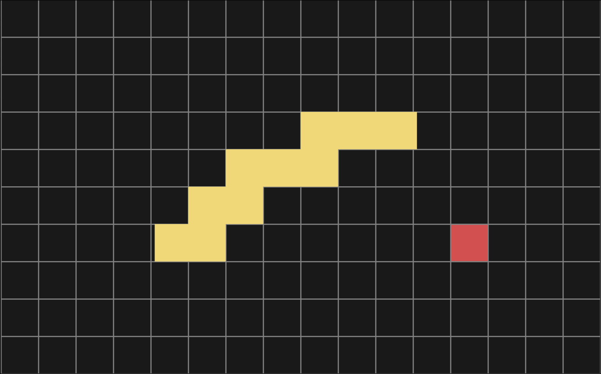
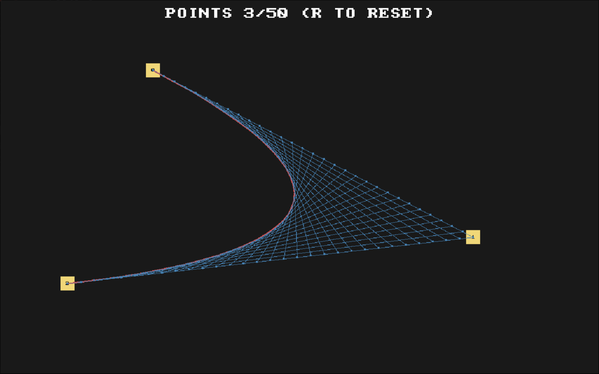
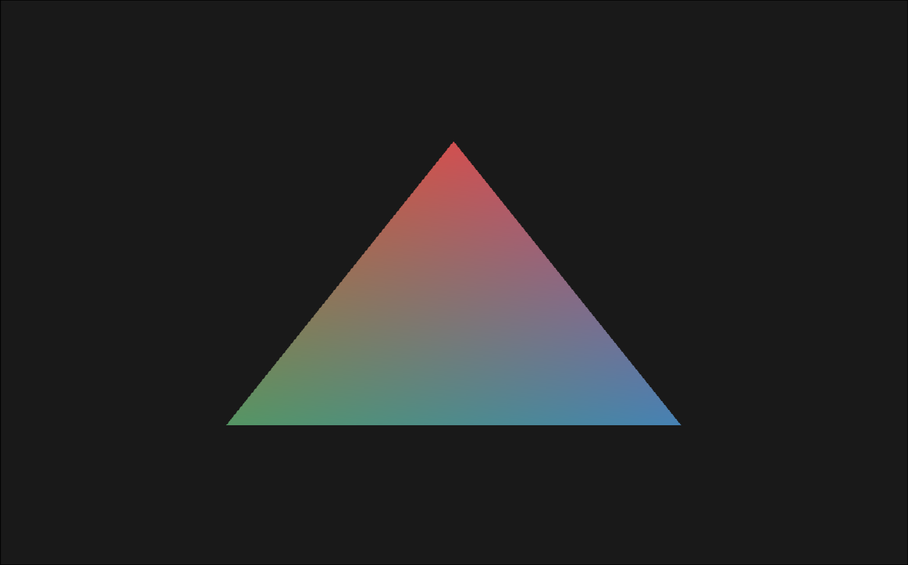
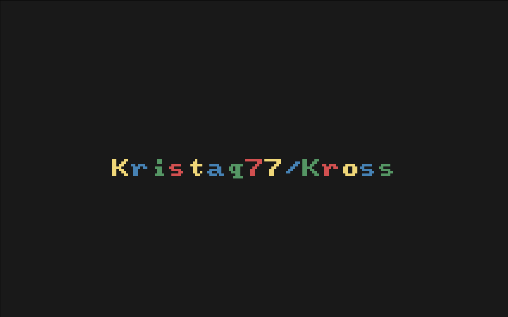
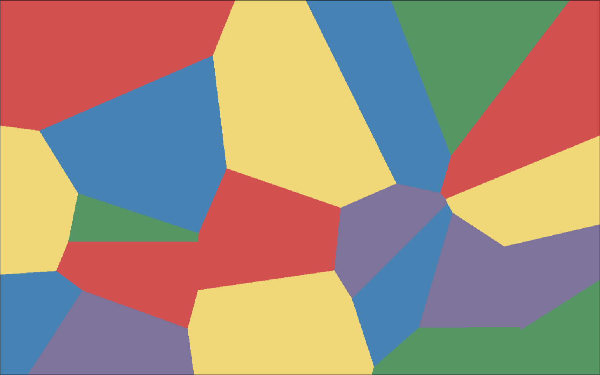

# kross
Kross is a header-only software rasterizer with a tiny math "library", color manipulation, procedural noise, drawing primitives and more.
It is my first big project after a good year of learning C and computer-graphics.
## Why this exists
Kross is meant to be read, so hopefully no complaints when this thing runs at 60 seconds per frame instead of 60 frames per second.        
This project is dedicated to God and Orthodox Christianity, as a small thank you for everything I have been given in life.
## Compatibility
Kross is kross-platform (I think) but works best for Linux.
## Contribution
I wont be accepting contributions because this is a personal project, and I want it to stay that way.

## Examples

  
  
  

  
  
  

  

