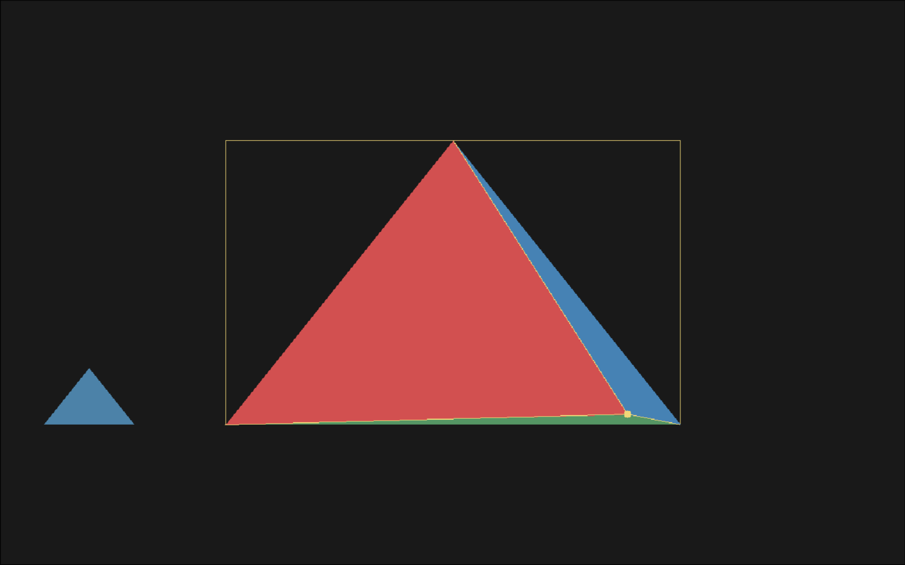

# kross

This project is my painful 1-year journey through C and computer graphics. 

Kross is a header-only software rasterizer with a tiny math "library", color manipulation, procedural noise, drawing primitives and more.

## Why this exists
It is meant to be read, so I dont wanna hear any complaints when this thing runs at 60 seconds per frame instead of 60 frames per second.        
It is very, very heavily commented, with comments and explanations that I wish I had starting out.

This project is dedicated to God and Orthodox Christianity, as a small thank you for everything I have been given in life.

## Compatibility
Kross is developed and tested for Arch Linux (btw). It uses OpenGL 1.1 as a presenter so it should work fine for Windows too.

## Contribution Policy
I wont be accepting contributions (trust me you didnt want to contribute anyway) because this is a personal project, and I want it to stay that way.

## Examples

  
  
  

  
  

